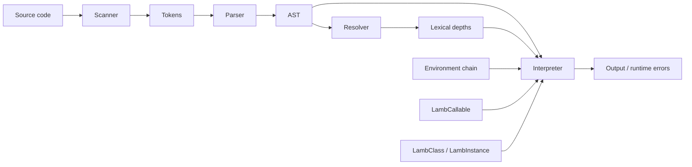

<div align="center">


# Lamb Interpreter

### A handwritten Java interpreter for a small, expressive, dynamically typed language.


Lamb is a compact interpreter project that turns source text into tokens, parses
those tokens into an abstract syntax tree, resolves lexical bindings, and walks
the tree to execute a real scripting language with variables, functions,
closures, classes, inheritance, fields, methods, `this`, `super`, and a native
`clock()` function.

</div>

---

## Table Of Contents

- [What Lamb Is](#what-lamb-is)
- [Quick Start](#quick-start)
- [Language Tour](#language-tour)
- [Architecture](#architecture)
- [Project Layout](#project-layout)
- [Grammar Snapshot](#grammar-snapshot)
- [Runtime Semantics](#runtime-semantics)
- [AST Generation](#ast-generation)
- [Diagnostics](#diagnostics)
- [Current Status](#current-status)
- [Roadmap](#roadmap)

---

## What Lamb Is

Lamb is a Java implementation of a small tree-walk scripting language. It is
small enough to study end to end, but rich enough to demonstrate the important
ideas behind language implementation:

- Lexical analysis with a scanner.
- Recursive descent parsing with operator precedence.
- AST modeling through generated Java classes.
- Visitor-based interpreter and resolver passes.
- Lexical scope resolution before execution.
- Dynamic runtime values represented as Java `Object`.
- First-class functions and closure capture.
- Classes as callable constructors.
- Instances with mutable fields.
- Method binding through `this`.
- Inheritance dispatch through `super`.

The project is best read as an interpreter laboratory: clean enough to learn
from, practical enough to run, and open-ended enough to extend.

---

## Quick Start

### Requirements

- A JDK with `javac` and `java` on your `PATH`.
- Verified in this workspace with `javac 24.0.1`.
- No build tool is required.

### Compile On Windows PowerShell

```powershell
$build = "out"
New-Item -ItemType Directory -Force -Path $build | Out-Null
javac -d $build (Get-ChildItem -Recurse -Filter *.java | Select-Object -ExpandProperty FullName)
```

### Compile On macOS Or Linux

```bash
mkdir -p out
javac -d out $(find src -name "*.java")
```

### Start The REPL

```bash
java -cp out com.lambinterpreter.lamb.Lamb
```

You should see:

```text
>>
```

### Run A Script

```bash
java -cp out com.lambinterpreter.lamb.Lamb path/to/program.lamb
```

On Windows PowerShell:

```powershell
java -cp out com.lambinterpreter.lamb.Lamb path\to\program.lamb
```

> Note: `.gitignore` currently ignores both `*.class` and `*.lamb`, so local
> script experiments and compiled classes are treated as development artifacts.

---

## Language Tour

Here is a complete Lamb program using classes, inheritance, initializers,
fields, method overriding, `this`, and `super`:

```lamb
class Person {
    init(name) {
        this.name = name;
    }

    introduce() {
        print "hello " + this.name;
    }
}

class Developer < Person {
    introduce() {
        super.introduce();
        print this.name + " writes Lamb";
    }
}

var dev = Developer("Ada");
dev.introduce();
```

Output:

```text
hello Ada
Ada writes Lamb
```

### Values

Lamb supports:

| Lamb value | Java runtime representation |
| --- | --- |
| `nil` | `null` |
| `true`, `false` | `Boolean` |
| Numbers | `Double` |
| Strings | `String` |
| Functions | `LambFunction` |
| Classes | `LambClass` |
| Instances | `LambInstance` |

### Variables And Blocks

```lamb
var volume = 100;

{
    var volume = 50;
    print volume;
}

print volume;
```

Output:

```text
50
100
```

Each block creates a new `Environment` linked to its enclosing environment.
Lookup starts from the innermost scope and walks outward, so shadowing works
naturally.

### Functions And Closures

```lamb
fun makeCounter() {
    var count = 0;

    fun next() {
        count = count + 1;
        return count;
    }

    return next;
}

var counter = makeCounter();
print counter();
print counter();
```

Output:

```text
1
2
```

Functions capture the environment where they are declared, which lets inner
functions keep using outer variables after the outer function returns.

### Control Flow

```lamb
for (var i = 0; i < 3; i = i + 1) {
    print i;
}

var n = 3;
while (n > 0) {
    print n;
    n = n - 1;
}
```

`for` loops are parsed and lowered into `while` loops inside the parser. That
keeps the interpreter smaller while preserving familiar syntax.

### Native Functions

```lamb
var start = clock();
print start;
```

`clock()` is defined in Java and registered in the global environment. It
returns the current time in seconds.

---

## Architecture



### 1. Scanner

`Scanner` reads raw source characters and emits `Token` objects.

It recognizes:

- Single-character punctuation such as `(`, `)`, `{`, `}`, `+`, `-`, `*`, `/`.
- One-or-two-character operators such as `!=`, `==`, `<=`, `>=`.
- Literals: strings and numbers.
- Identifiers and reserved words.
- Line comments beginning with `//`.

### 2. Parser

`Parser` is a handwritten recursive descent parser. It converts the token stream
into `Expr` and `Stmt` trees.

Highlights:

- One parser method per grammar level.
- Operator precedence is represented by the method call stack.
- Assignment is right-associative.
- `for` loops are desugared into `while` loops.
- Parser synchronization lets it recover after syntax errors.

### 3. AST

`Expr.java` and `Stmt.java` contain the tree node classes. They follow the
visitor pattern, so operations live in dedicated passes rather than inside the
nodes themselves.

Current expression nodes:

```text
Assign, Binary, Call, Get, Grouping, Literal, Logical,
Set, Super, This, Unary, Variable
```

Current statement nodes:

```text
Block, Class, Expression, Function, If, Print,
Return, Var, While
```

### 4. Resolver

`Resolver` performs static lexical analysis before execution.

It:

- Tracks nested scopes.
- Detects duplicate local declarations.
- Prevents reading a local variable inside its own initializer.
- Resolves local variable distances for fast runtime lookup.
- Validates `return`, `this`, `super`, and inheritance usage.

### 5. Interpreter

`Interpreter` walks the AST and executes statements or evaluates expressions.

It:

- Stores globals and local environments.
- Evaluates arithmetic, comparison, equality, unary, and grouping expressions.
- Executes blocks, branches, loops, declarations, functions, returns, and classes.
- Uses `LambCallable` to call native functions, user functions, and classes.
- Uses `RuntimeError` for runtime diagnostics tied to source tokens.

### 6. Runtime Objects

The object model is compact:

| Type | Role |
| --- | --- |
| `Environment` | Lexical scope frame with optional enclosing scope. |
| `LambCallable` | Interface for anything callable with `()`. |
| `LambFunction` | User-defined function plus captured closure. |
| `LambClass` | Callable class object and method table. |
| `LambInstance` | Runtime object with mutable fields. |
| `Return` | Internal control-flow exception for function returns. |
| `RuntimeError` | Runtime exception with token location. |

---

## Project Layout

```text
.
|-- .gitignore
|-- README.md
`-- src
    `-- com
        `-- lambinterpreter
            |-- lamb
            |   |-- Lamb.java              # CLI entrypoint, REPL, file runner
            |   |-- Scanner.java           # Source characters -> tokens
            |   |-- Token.java             # Token value object
            |   |-- TokenType.java         # Token enum
            |   |-- Parser.java            # Tokens -> AST
            |   |-- Expr.java              # Expression AST nodes
            |   |-- Stmt.java              # Statement AST nodes
            |   |-- Resolver.java          # Static lexical resolver
            |   |-- Interpreter.java       # Tree-walk runtime
            |   |-- Environment.java       # Scope chain
            |   |-- LambCallable.java      # Callable protocol
            |   |-- LambFunction.java      # Functions and closures
            |   |-- LambClass.java         # Classes and inheritance
            |   |-- LambInstance.java      # Object fields and method lookup
            |   |-- Return.java            # Function return control flow
            |   |-- RuntimeError.java      # Runtime diagnostics
            |   |-- AstPrinter.java        # Commented debugging/reference utility
            |   `-- knowledge.md           # Learning notes on interpreters
            `-- tool
                `-- GenerateAst.java       # AST source generator
```

---

## Grammar Snapshot

This is the practical shape of the language accepted by the parser:

```text
program        -> declaration* EOF ;

declaration    -> classDecl
                | funDecl
                | varDecl
                | statement ;

classDecl      -> "class" IDENTIFIER ( "<" IDENTIFIER )?
                  "{" function* "}" ;

funDecl        -> "fun" function ;
function       -> IDENTIFIER "(" parameters? ")" block ;
parameters     -> IDENTIFIER ( "," IDENTIFIER )* ;

varDecl        -> "var" IDENTIFIER ( "=" expression )? ";" ;

statement      -> forStmt
                | ifStmt
                | printStmt
                | returnStmt
                | whileStmt
                | block
                | exprStmt ;

forStmt        -> "for" "("
                  ( varDecl | exprStmt | ";" )
                  expression? ";"
                  expression? ")"
                  statement ;

ifStmt         -> "if" "(" expression ")" statement
                  ( "else" statement )? ;

whileStmt      -> "while" "(" expression ")" statement ;
printStmt      -> "print" expression ";" ;
returnStmt     -> "return" expression? ";" ;
block          -> "{" declaration* "}" ;
exprStmt       -> expression ";" ;

expression     -> assignment ;
assignment     -> ( call "." )? IDENTIFIER "=" assignment
                | logic_or ;

logic_or       -> logic_and ( "or" logic_and )* ;
logic_and      -> equality ( "and" equality )* ;
equality       -> comparison ( ( "!=" | "==" ) comparison )* ;
comparison     -> term ( ( ">" | ">=" | "<" | "<=" ) term )* ;
term           -> factor ( ( "-" | "+" ) factor )* ;
factor         -> unary ( ( "/" | "*" ) unary )* ;
unary          -> ( "!" | "-" ) unary | call ;
call           -> primary ( "(" arguments? ")" | "." IDENTIFIER )* ;
arguments      -> expression ( "," expression )* ;
primary        -> NUMBER
                | STRING
                | "true"
                | "false"
                | "nil"
                | "this"
                | "super" "." IDENTIFIER
                | IDENTIFIER
                | "(" expression ")" ;
```

---

## Runtime Semantics

### Truthiness

Lamb follows a simple truthiness rule:

- `false` is falsey.
- `nil` is falsey.
- Everything else is truthy.

### Arithmetic And Concatenation

The interpreter supports:

| Operator | Behavior |
| --- | --- |
| `-`, `*`, `/` | Numeric operands only. |
| `+` | Numeric addition, string concatenation, string-number mixing. |
| `>`, `>=`, `<`, `<=` | Numeric comparison. |
| `==`, `!=` | Runtime equality. |
| `!` | Truthiness negation. |

Examples:

```lamb
print 40 + 2;
print "Lamb " + "rocks";
print "version " + 1;
```

Output:

```text
42
Lamb rocks
version 1
```

### Functions

- Functions are first-class values.
- Calls validate arity before execution.
- Closures keep a reference to their declaration environment.
- `return` is implemented as an internal exception to unwind execution.
- Parameter and argument lists are guarded at 255 entries.

### Classes

- Classes are callable.
- Calling a class creates a new instance.
- `init` acts as the initializer.
- Initializers always return `this`.
- Methods are bound to instances when accessed.
- Subclasses can call superclass methods through `super.method()`.

---

## AST Generation

The AST classes are generated by `GenerateAst.java`.

After compiling, regenerate `Expr.java` and `Stmt.java` with:

```bash
java -cp out com.lambinterpreter.tool.GenerateAst src/com/lambinterpreter/lamb
```

On Windows PowerShell:

```powershell
java -cp out com.lambinterpreter.tool.GenerateAst src\com\lambinterpreter\lamb
```

Use this after changing the node definitions inside `GenerateAst.java`.
Regeneration overwrites the AST source files, so review the diff afterward.

---

## Diagnostics

Lamb has four layers of error handling:

| Layer | Examples | Behavior |
| --- | --- | --- |
| Scanner | Unexpected characters, unterminated strings. | Reports source line. |
| Parser | Missing semicolons, invalid expressions, malformed declarations. | Synchronizes and continues parsing. |
| Resolver | Invalid scope usage, bad `return`, bad `this` or `super`. | Reports before interpretation. |
| Runtime | Undefined variables, invalid operands, calling non-callables. | Stops execution with source line. |

`Lamb.java` uses conventional process exits:

```text
64  invalid command usage
65  scan/parse/resolve error
70  runtime error
```

---

## Current Status

This is an experimental interpreter, not a production runtime yet.

Working and verified in this workspace:

- Fresh source compile.
- REPL startup.
- Script execution.
- Variables and lexical blocks.
- Functions and closures.
- Classes, fields, methods, inheritance, `this`, and `super`.
- Native `clock()` registration.

Known hardening items:

- `and` and `or` are scanned, parsed, and represented as `Expr.Logical`, but
  the current runtime visitor path should be fixed and regression-tested before
  relying on logical short-circuiting.
- `AstPrinter.java` is currently parked as a commented reference utility.
- There is no automated test suite yet.
- There is no build-system wrapper yet.
- `.lamb` example files are ignored by the current `.gitignore`.

---

## Roadmap

Good next steps:

- Add a focused test suite for scanner, parser, resolver, and runtime behavior.
- Fix and test logical `and` / `or` short-circuit evaluation.
- Add committed example programs by adjusting `.gitignore` or using a dedicated examples directory.
- Add a build tool or script for repeatable compile/run/test workflows.
- Restore or replace `AstPrinter` as a real debugging utility.
- Add richer standard library functions.
- Explore arrays, maps, modules, imports, and file IO.
- Improve diagnostics with source snippets and column numbers.
- Add CI so every interpreter change runs the same checks.

---

## Why This Project Matters

Lamb is a useful interpreter study because the whole system is visible:

```text
characters -> tokens -> syntax tree -> resolved bindings -> runtime behavior
```

There is no parser generator, VM, bytecode compiler, or framework hiding the
interesting parts. Every feature has a direct path through the source, which
makes the project unusually friendly for learning, debugging, and extending.
