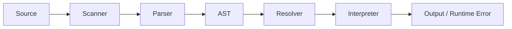

<div align="center">


<h1>Lamb Interpreter</h1>

<p><strong>A compact Java runtime for a custom scripting language.</strong></p>

<p>
  
  
  
  
</p>

<p>
  <a href="#quick-start"><strong>Quick Start</strong></a>
  |
  <a href="https://deebyanshujha.github.io/docs-lamb/"><strong>Hosted Docs</strong></a>
  |
  <a href="#language-tour"><strong>Language Tour</strong></a>
  |
  <a href="#architecture"><strong>Architecture</strong></a>
  |
  <a href="#project-map"><strong>Project Map</strong></a>
  |
  <a href="#status"><strong>Status</strong></a>
</p>

<table>
  <tr>
    <td><strong>0</strong><br>build tools required</td>
    <td><strong>4</strong><br>core passes: scan, parse, resolve, run</td>
    <td><strong>100%</strong><br>plain Java source</td>
  </tr>
</table>

<table>
  <tr>
    <td><strong>Handwritten Front End</strong><br>Scanner, tokens, recursive descent parser, and generated AST nodes.</td>
    <td><strong>Real Runtime Semantics</strong><br>Lexical scopes, closures, callable classes, instances, fields, and methods.</td>
  </tr>
  <tr>
    <td><strong>Static Resolver Pass</strong><br>Precomputes local scope depth and catches invalid <code>this</code>, <code>super</code>, and <code>return</code> usage.</td>
    <td><strong>Readable Java Design</strong><br>Small files, visitor-based passes, and runtime objects that are easy to trace.</td>
  </tr>
</table>

<pre>source.lamb -> tokens -> AST -> resolved scopes -> execution</pre>

</div>

---

## Quick Start

Lamb needs only a JDK. It was verified in this workspace with `javac 24.0.1`.

**Compile on Windows PowerShell**

```powershell
$build = "out"
New-Item -ItemType Directory -Force -Path $build | Out-Null
javac -d $build (Get-ChildItem -Recurse -Filter *.java | Select-Object -ExpandProperty FullName)
```

**Compile on macOS or Linux**

```bash
mkdir -p out
javac -d out $(find src -name "*.java")
```

**Run the REPL**

```bash
java -cp out com.lambinterpreter.lamb.Lamb
```

**Run a script**

```bash
java -cp out com.lambinterpreter.lamb.Lamb path/to/program.lamb
```

> `.gitignore` currently ignores `*.class` and `*.lamb`, so compiled output and
> local script experiments stay out of version control.

---

## Language Tour

Lamb supports variables, blocks, functions, closures, loops, classes,
inheritance, fields, methods, `this`, `super`, `return`, `print`, loop control
with `break` and `continue`, and native functions such as `clock()`, `input()`,
and `countSheep()`.

### Classes and Inheritance

```lamb
class Person {
    init(name) {
        this.name = name;
    }

    introduce() {
        print "hello " + this.name;
    }
}

class Developer < Person {
    introduce() {
        super.introduce();
        print this.name + " writes Lamb";
    }
}

var dev = Developer("Ada");
dev.introduce();
```

Output:

```text
hello Ada
Ada writes Lamb
```

### Loop Control

```lamb
for (var i = 0; i < 10; i = i + 1) {
    if (i == 3) continue;
    if (i == 7) break;
    print i;
}
```

### User Input

```lamb
var name = input("What is your name? ");
print "Hello, " + name + "!";
```

### Built-in Functions and Constants

| Name           | Arity  | Description                                                  |
| -------------- | ------ | ------------------------------------------------------------ |
| `clock()`      | 0      | Returns the current time in seconds since the Unix epoch.    |
| `input()`      | 0 or 1 | Reads a line from stdin. An optional argument prints a prompt first. |
| `countSheep()` | 1      | Prints `🐑 n sheep` lines with a one-second delay per sheep. |
| `__LAMB__`     | —      | Built-in constant: `"Lamb v0.1"`.                            |
| `__SHEPHERD__` | —      | Built-in constant: author credit.                            |

### Core Behavior

| Area         | Support                                                                          |
| ------------ | -------------------------------------------------------------------------------- |
| Values       | `nil`, booleans, numbers, strings, functions, classes, instances.                 |
| Expressions  | Arithmetic, comparison, equality, unary operators, calls, property access.        |
| State        | Variables, assignment, block scopes, object fields.                               |
| Functions    | First-class functions, closures, arity checks, `return`.                         |
| Classes      | Constructors through `init`, inheritance with `<`, `this`, `super`.              |
| Control flow | `if`, `else`, `while`, parser-lowered `for`, `break`, `continue`, `print`.       |
| Coercion     | Mixed string + number concatenation is supported (e.g., `"age: " + 25`).         |

---

## Architecture



| Component            | Responsibility                                                                                                   |
| -------------------- | ---------------------------------------------------------------------------------------------------------------- |
| `Scanner`            | Converts source characters into tokens and handles comments, literals, identifiers, and keywords.                |
| `Token` / `TokenType`| Immutable token data class and enum of all lexeme types (operators, literals, keywords including `break`/`continue`). |
| `Parser`             | Builds `Expr` and `Stmt` trees with recursive descent and operator precedence.                                   |
| `Expr` / `Stmt`      | Generated AST node families using the visitor pattern (produced by `GenerateAst`).                               |
| `Resolver`           | Performs lexical analysis before execution and records scope depth.                                               |
| `Interpreter`        | Walks the AST, evaluates expressions, executes statements, and reports runtime errors.                           |
| `Environment`        | Scope chain with lexical nesting and `getAt`/`assignAt` for resolved variable access.                            |
| `LambCallable`       | Interface for all callable objects (functions, classes, native functions).                                        |
| `LambFunction`       | User-defined functions and closures with support for `this` binding.                                             |
| `LambClass`          | Class object: stores methods, superclass link, and acts as a callable constructor.                               |
| `LambInstance`       | Instance with a dynamic field map and method lookup via its class.                                               |
| `InputFunction`      | Native `input()` implementation accepting an optional prompt argument.                                           |
| `Return`             | Exception-based control flow to unwind the call stack on `return`.                                               |
| `BreakException`     | Exception-based control flow for `break` inside loops.                                                           |
| `ContinueException`  | Exception-based control flow for `continue` inside loops.                                                        |
| `RuntimeError`       | Error type carrying the offending token for diagnostic reporting.                                                |
| `AstPrinter`         | Debug utility that pretty-prints expression trees (currently commented out).                                     |

---

## Project Map

```text
.
|-- lamb.png                    # Project logo
|-- LICENSE                     # MIT license
|-- README.md
|-- .gitignore                  # Ignores *.class and *.lamb
`-- src/com/lambinterpreter
    |-- lamb
    |   |-- Lamb.java           # CLI entrypoint, REPL, script runner
    |   |-- Scanner.java        # Source -> tokens
    |   |-- Token.java          # Immutable token record (type, lexeme, literal, line)
    |   |-- TokenType.java      # Enum of all token types
    |   |-- Parser.java         # Tokens -> AST (recursive descent)
    |   |-- Expr.java           # Expression AST nodes (generated)
    |   |-- Stmt.java           # Statement AST nodes (generated)
    |   |-- Resolver.java       # Static lexical resolver
    |   |-- Interpreter.java    # Tree-walk runtime
    |   |-- Environment.java    # Scope chain with depth-indexed access
    |   |-- LambCallable.java   # Callable interface (arity + call)
    |   |-- LambFunction.java   # User-defined functions and closures
    |   |-- LambClass.java      # Classes and inheritance
    |   |-- LambInstance.java   # Object fields and method dispatch
    |   |-- InputFunction.java  # Native input() with optional prompt
    |   |-- Return.java         # Exception for return control flow
    |   |-- BreakException.java # Exception for break control flow
    |   |-- ContinueException.java # Exception for continue control flow
    |   |-- RuntimeError.java   # Token-aware runtime error
    |   `-- AstPrinter.java     # Debug AST printer (commented out)
    `-- tool
        `-- GenerateAst.java    # Regenerates Expr.java and Stmt.java
```

Regenerate AST sources after editing `GenerateAst.java`:

```bash
java -cp out com.lambinterpreter.tool.GenerateAst src/com/lambinterpreter/lamb
```

---

## Syntax Snapshot

```text
program     -> declaration* EOF
declaration -> class | function | variable | statement
statement   -> if | while | for | print | return | break | continue | block | expression
expression  -> assignment -> logic -> equality -> comparison
             -> term -> factor -> unary -> call -> primary
class       -> class Name (< Superclass)? { methods }
function    -> fun name(parameters) { body }
```

The parser keeps precedence readable by giving each level its own method. `for`
loops are desugared into `while` loops before interpretation.

---

## Status

### Working

- Fresh source compilation, REPL startup, and script execution.
- Variables, lexical scopes, functions, closures, and classes.
- Inheritance, initializers, method binding, `this`, and `super`.
- `break` and `continue` for loop control.
- Mixed-type string + number concatenation.
- Native functions: `clock()`, `input()`, `countSheep()`.
- Built-in constants: `__LAMB__`, `__SHEPHERD__`.
- Scanner, parser, resolver, and runtime diagnostics.

### Known Hardening Items

- `and` and `or` are scanned and parsed, but `visitLogicalExpr` currently
  evaluates the logical node itself instead of its left operand
  (`evaluate(expr)` vs. `evaluate(expr.left)`), causing infinite recursion.
  This should be fixed and regression-tested before relying on logical operators.
- `AstPrinter.java` is currently parked as a commented reference utility.
- Automated tests and a build wrapper would make the project easier to evolve.

---

## Contributing

1. Fork the repository and create a feature branch.
2. Compile and test with the commands in [Quick Start](#quick-start).
3. Keep the single-file-per-concept style: small classes, visitor-based passes.
4. Open a pull request with a clear description of what changed and why.

---

## License

Released under the [MIT License](LICENSE).

---

## Why Lamb Is Worth Studying

Lamb keeps the full interpreter pipeline visible:

```text
characters -> tokens -> syntax tree -> resolved bindings -> runtime behavior
```

There is no hidden parser generator or framework. Every language feature has a
traceable path through the source, which makes Lamb a friendly project for
learning, debugging, and extending a real interpreter.
