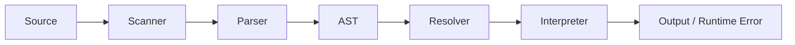

<div align="center">


<h1>Lamb Interpreter</h1>

<p><strong>A compact Java runtime for a custom scripting language.</strong></p>

<p>
  
  
  
  
</p>

<p>
  <a href="#quick-start"><strong>Quick Start</strong></a>
  |
  <a href="https://deebyanshujha.github.io/docs-lamb/"><strong>Hosted Docs</strong></a>
  |
  <a href="#language-tour"><strong>Language Tour</strong></a>
  |
  <a href="#architecture"><strong>Architecture</strong></a>
  |
  <a href="#project-map"><strong>Project Map</strong></a>
  |
  <a href="#status"><strong>Status</strong></a>
</p>

<table>
  <tr>
    <td><strong>0</strong><br>build tools required</td>
    <td><strong>4</strong><br>core passes: scan, parse, resolve, run</td>
    <td><strong>100%</strong><br>plain Java source</td>
  </tr>
</table>

<table>
  <tr>
    <td><strong>Handwritten Front End</strong><br>Scanner, tokens, recursive descent parser, and generated AST nodes.</td>
    <td><strong>Real Runtime Semantics</strong><br>Lexical scopes, closures, callable classes, instances, fields, and methods.</td>
  </tr>
  <tr>
    <td><strong>Static Resolver Pass</strong><br>Precomputes local scope depth and catches invalid <code>this</code>, <code>super</code>, and <code>return</code> usage.</td>
    <td><strong>Readable Java Design</strong><br>Small files, visitor-based passes, and runtime objects that are easy to trace.</td>
  </tr>
</table>

<pre>source.lamb -> tokens -> AST -> resolved scopes -> execution</pre>

</div>

---

## Quick Start

Lamb needs only a JDK. It was verified in this workspace with `javac 24.0.1`.

**Compile on Windows PowerShell**

```powershell
$build = "out"
New-Item -ItemType Directory -Force -Path $build | Out-Null
javac -d $build (Get-ChildItem -Recurse -Filter *.java | Select-Object -ExpandProperty FullName)
```

**Compile on macOS or Linux**

```bash
mkdir -p out
javac -d out $(find src -name "*.java")
```

**Run the REPL**

```bash
java -cp out com.lambinterpreter.lamb.Lamb
```

**Run a script**

```bash
java -cp out com.lambinterpreter.lamb.Lamb path/to/program.lamb
```

> `.gitignore` currently ignores `*.class` and `*.lamb`, so compiled output and
> local script experiments stay out of version control.

---

## Language Tour

Lamb supports variables, blocks, functions, closures, loops, classes,
inheritance, fields, methods, `this`, `super`, `return`, `print`, and native
functions such as `clock()`.

```lamb
class Person {
    init(name) {
        this.name = name;
    }

    introduce() {
        print "hello " + this.name;
    }
}

class Developer < Person {
    introduce() {
        super.introduce();
        print this.name + " writes Lamb";
    }
}

var dev = Developer("Ada");
dev.introduce();
```

Output:

```text
hello Ada
Ada writes Lamb
```

**Core behavior**

| Area         | Support                                                                    |
| ------------ | -------------------------------------------------------------------------- |
| Values       | `nil`, booleans, numbers, strings, functions, classes, instances.          |
| Expressions  | Arithmetic, comparison, equality, unary operators, calls, property access. |
| State        | Variables, assignment, block scopes, object fields.                        |
| Functions    | First-class functions, closures, arity checks, `return`.                   |
| Classes      | Constructors through `init`, inheritance with `<`, `this`, `super`.        |
| Control flow | `if`, `else`, `while`, parser-lowered `for`, `print`.                      |

---

## Architecture



| Component       | Responsibility                                                                                    |
| --------------- | ------------------------------------------------------------------------------------------------- |
| `Scanner`       | Converts source characters into tokens and handles comments, literals, identifiers, and keywords. |
| `Parser`        | Builds `Expr` and `Stmt` trees with recursive descent and operator precedence.                    |
| `Expr` / `Stmt` | Generated AST node families using the visitor pattern.                                            |
| `Resolver`      | Performs lexical analysis before execution and records scope depth.                               |
| `Interpreter`   | Walks the AST, evaluates expressions, executes statements, and reports runtime errors.            |
| Runtime objects | `Environment`, `LambFunction`, `LambClass`, `LambInstance`, `LambCallable`, `Return`.             |

---

## Project Map

```text
.
|-- lamb.png
|-- LICENSE
|-- README.md
`-- src/com/lambinterpreter
    |-- lamb
    |   |-- Lamb.java           # CLI entrypoint, REPL, script runner
    |   |-- Scanner.java        # Source -> tokens
    |   |-- Parser.java         # Tokens -> AST
    |   |-- Expr.java           # Expression AST nodes
    |   |-- Stmt.java           # Statement AST nodes
    |   |-- Resolver.java       # Static lexical resolver
    |   |-- Interpreter.java    # Tree-walk runtime
    |   |-- Environment.java    # Scope chain
    |   |-- LambFunction.java   # Functions and closures
    |   |-- LambClass.java      # Classes and inheritance
    |   `-- LambInstance.java   # Object fields and methods
    `-- tool
        `-- GenerateAst.java    # Regenerates Expr.java and Stmt.java
```

Regenerate AST sources after editing `GenerateAst.java`:

```bash
java -cp out com.lambinterpreter.tool.GenerateAst src/com/lambinterpreter/lamb
```

---

## Syntax Snapshot

```text
program     -> declaration* EOF
declaration -> class | function | variable | statement
statement   -> if | while | for | print | return | block | expression
expression  -> assignment -> logic -> equality -> comparison
             -> term -> factor -> unary -> call -> primary
class       -> class Name (< Superclass)? { methods }
function    -> fun name(parameters) { body }
```

The parser keeps precedence readable by giving each level its own method. `for`
loops are desugared into `while` loops before interpretation.

---

## Status

Working in this repository:

- Fresh source compilation, REPL startup, and script execution.
- Variables, lexical scopes, functions, closures, loops, and classes.
- Inheritance, initializers, method binding, `this`, and `super`.
- Native `clock()` function.
- Scanner, parser, resolver, and runtime diagnostics.

Known hardening items:

- `and` and `or` are scanned and parsed, but logical short-circuit execution
  should be fixed and regression-tested before relying on it.
- `AstPrinter.java` is currently parked as a commented reference utility.
- Automated tests and a build wrapper would make the project easier to evolve.

---

## License

Released under the [MIT License](LICENSE).

---

## Why Lamb Is Worth Studying

Lamb keeps the full interpreter pipeline visible:

```text
characters -> tokens -> syntax tree -> resolved bindings -> runtime behavior
```

There is no hidden parser generator or framework. Every language feature has a
traceable path through the source, which makes Lamb a friendly project for
learning, debugging, and extending a real interpreter.
